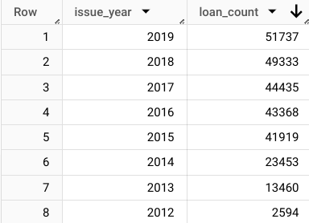
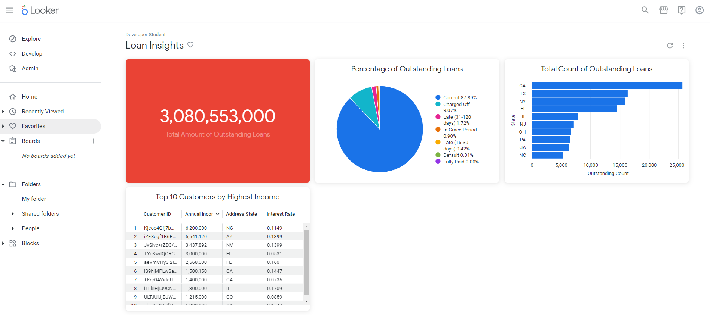

## Unlocking Lending Insights | Cloud Data Analytics
  Prepared for: TheLook Fintech Executive Team
### Overview
  TheLook Fintech's data team is developing a two-part data analytics project to help the treasury 
department analyze key metrics like cash flow, loan purpose, and borrower location. A report and 
interactive dashboard were developed, focusing on the total number of loans issued and key metrics 
needed to assess loan health and make data-driven decisions.
### Objective:

  #### Target Goal 1:
  Conduct an analysis of the Fintech dataset including a preliminary report identifying the total number of loans issued by day and year.
    
 #### Target Goal 2: 
  Build an interactive dashboard to allow 
    the treasury team to access 
    key performance metrics.
 #### Impact:
  This project provides valuable insights to inform 
    lending decisions, mitigate risk, 
    and tailor financial offerings.
### Next Steps
  * Gather feedback from users 
  on the functionality and 
  usefulness of the dashboard. 
  Use this feedback to iterate 
  and improve the dashboard.
  * Consider using data analysis 
  to segment borrowers based 
  on their characteristics and 
  loan behavior. This could help 
  TheLook Fintech tailor their 
  lending products, outreach 
  strategies, and 
  communications to different 
  borrower groups.
### Results
  * The results of the data analysis demonstrate that the total 
  number of loans has increased steadily from 2012 through 
  2019
    * Figure 1 – Loan Count by Year 2012–2019

  * Data analysis reveals three key aspects of the loan 
  portfolio—total outstanding balance, borrower locations, and 
  homeowner income index—displayed on the interactive 
  dashboard.
    * Figure 2 – Interactive Dashboard

  * **Note:** Dashboard includes a single-value visualization, bar chart, table highlighting key metrics, and pie chart.

